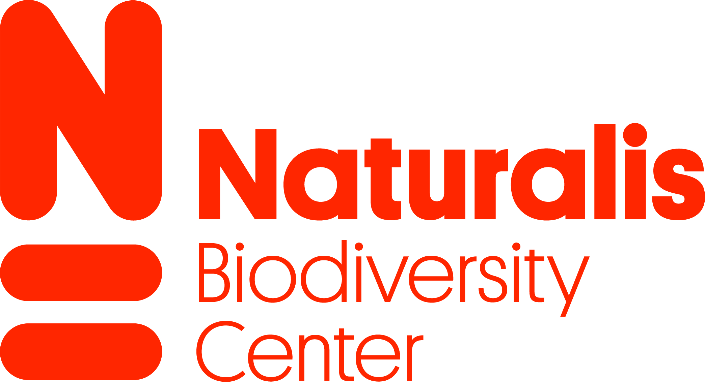

# NATURALIS-INTERNSHIP
This repository contains tools, wrappers, and documentation created during my
internship at Naturalis Biodiversity Center in Leiden, The Netherlands.

The internship ran from February 2018 to December 2018 and focused on
developing and integrating bioinformatics tools for the Naturalis Galaxy
environment, with a primary focus on metabarcoding analysis. The work included
both adapting existing software and developing new scripts for
project-specific functionality.

This project reflects a learning-driven internship period in which I gained
practical experience in bioinformatics tooling, workflow integration, and
command-line development.

The internship was carried out in collaboration with Leiden University Medical
Center (LUMC), in the context of research related to hay fever and pollen.

It was an enjoyable and valuable experience in which I learned a great deal,
both technically and professionally.

```text
Copyright (C) 2025 Jasper Boom. All rights reserved.

Proprietary and confidential. Unauthorized use, copying, modification,
distribution, reverse engineering, disclosure, or creation of derivative
works is strictly prohibited without prior written permission from
Jasper Boom.
```